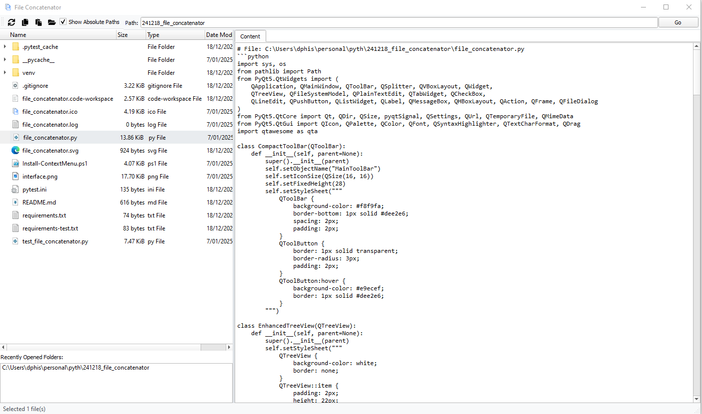

# Windows File/Folder Concatenation Including Absolute/Relative Filenames and Backticks code language

Purpose of this application is to assist with code uploads to web-based LLMs such as ChatGPT and Claude as a simple solution to providing a limited number of files. This application includes drag'n'drop capabilities from the content panel. 




```
file_concatenator.py
├── .gitignore
├── Cleanup-OldRegistry.ps1
├── file_concatenator.ico
├── file_concatenator.py
├── file_concatenator.svg
├── Install-ExeContextMenu.ps1
├── Install-PythonContextMenu.ps1
├── interface.png
├── pytest.ini
├── README.md
├── requirements.txt
├── test_file_concatenator.py

```

### Installation
```bash
# To try the application out:
python -m venv venv
pip install -r requirements.txt 
python file_concatenator.py
```


```bash
# Create .exe 
python -m venv venv
pip install -r requirements.txt 
pyinstaller file_concatenator.spec
```

```ps1
# Add to Windows context menu
./Install-ExeContextMenu.ps1
```

### Testing
```bash
pytest
```

### Uninstallation from Context Menu
```ps1
# Remove from context menu
./Cleanup-Registry.ps1
```
